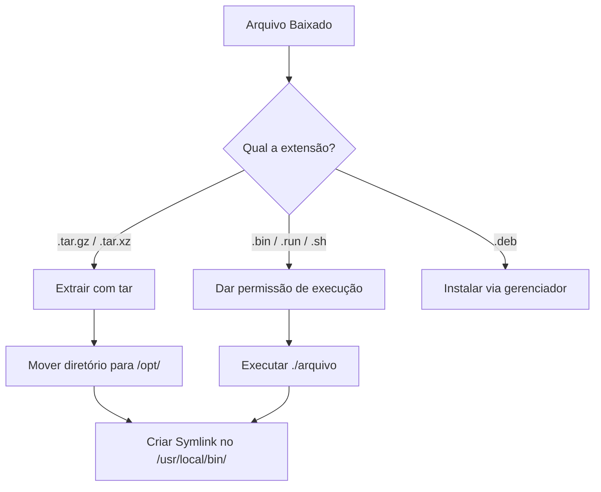

# Instalação de Binários e Pacotes Manuais no Linux

Este guia documenta o padrão para instalar softwares que não estão nos repositórios oficiais (apt/pacman) e vêm em formatos de pacote ou binários brutos.

## 🗺️ Fluxo de Decisão


1. Arquivos Compactados (.tar.gz, .tar.xz, .tar.bz2)
Muitos programas (como Node.js, ferramentas do Spring Boot, ou IDEs) vêm pré-compilados em uma pasta compactada.

Passo a passo:

Extrair o arquivo:

```Bash
tar -xvf nome-do-arquivo.tar.gz
```
(Nota: O parâmetro x é para extrair, v para verbose/ver, f para file/arquivo).

Mover para o diretório padrão de softwares de terceiros (/opt/):

```Bash
sudo mv nome-da-pasta-extraida /opt/nome-do-programa
```

Criar um Symlink (Atalho) para rodar de qualquer lugar:
Para não ter que digitar o caminho completo toda vez, criamos um link simbólico na pasta de binários do sistema.

```Bash
sudo ln -s /opt/nome-do-programa/bin/executavel /usr/local/bin/nome-do-programa
```

Agora você pode rodar o programa digitando apenas nome-do-programa no terminal.

2. Instaladores Executáveis (.bin, .run, .sh, .AppImage)
Estes são scripts ou binários que contêm o instalador ou o próprio programa embutido. O Linux, por segurança, baixa esses arquivos sem permissão de execução.

Passo a passo:

Dar permissão de execução (chmod):

```Bash
chmod +x nome-do-arquivo.bin
```
Executar o instalador:

Bash
./nome-do-arquivo.bin
(Se o instalador precisar instalar dependências no sistema inteiro, rode com sudo ./nome-do-arquivo.bin).

3. Pacotes Debian (.deb)
Se você estiver usando uma base Debian/Ubuntu, muitos programas fornecem o pacote direto.

Instalação rápida:

Bash
sudo apt install ./nome-do-arquivo.deb
# OU
sudo dpkg -i nome-do-arquivo.deb
(Usar o apt install ./ é preferível ao dpkg pois ele já resolve e baixa as dependências automaticamente, se existirem).

💡 Dica de Troubleshooting
Se ao tentar rodar o programa pelo terminal você receber um erro de "comando não encontrado", verifique se o Symlink foi criado na pasta correta:

```Bash
ls -la /usr/local/bin | grep nome-do-programa
```

---

Você quer que eu adicione a essa nota as instruções de como criar um arquivo `.desktop` pa
